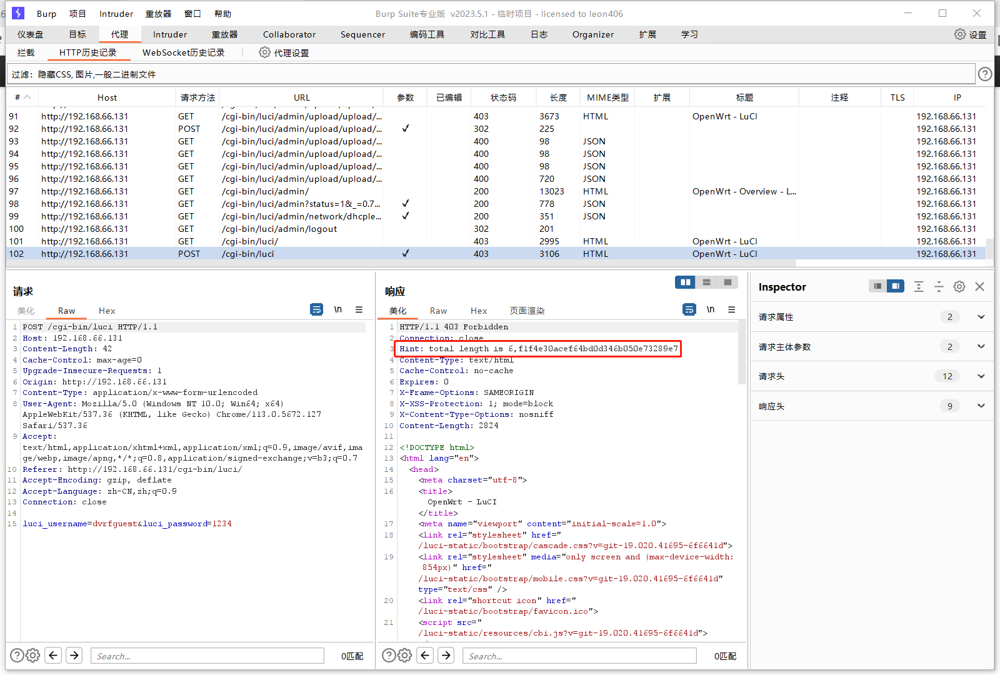
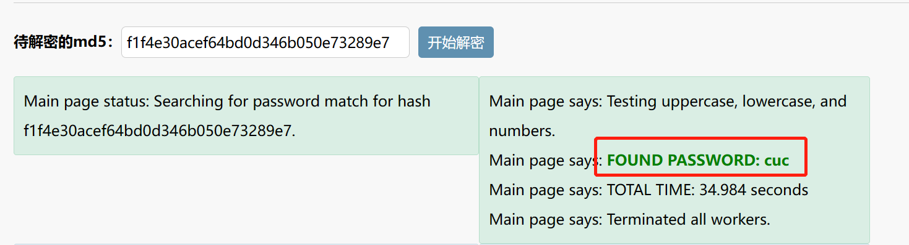
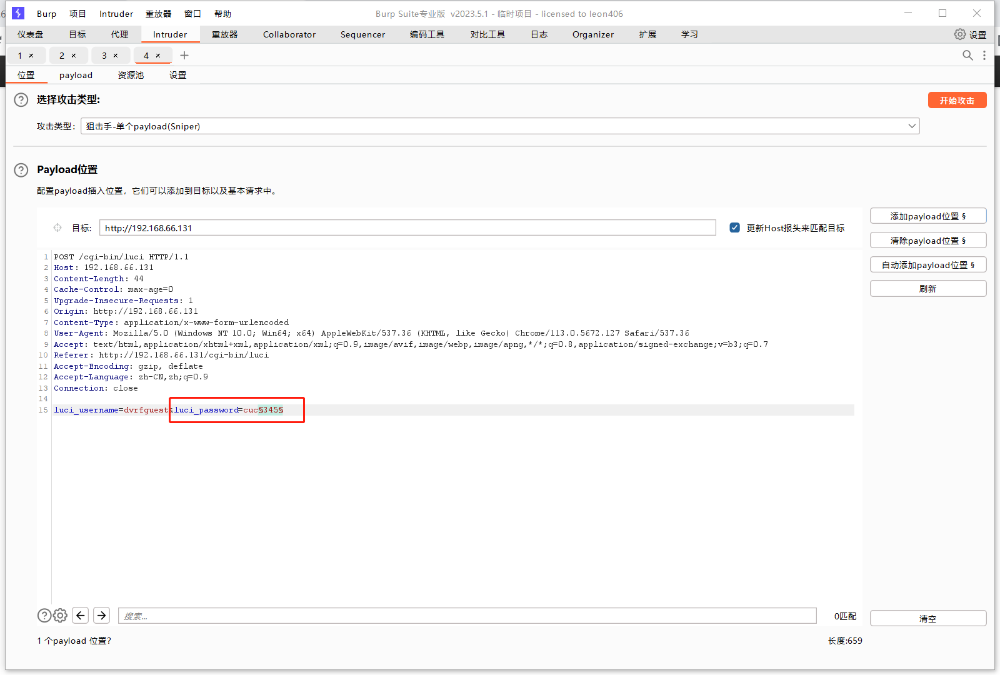
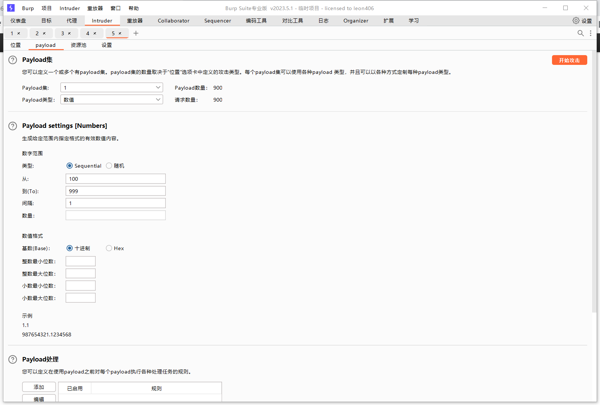
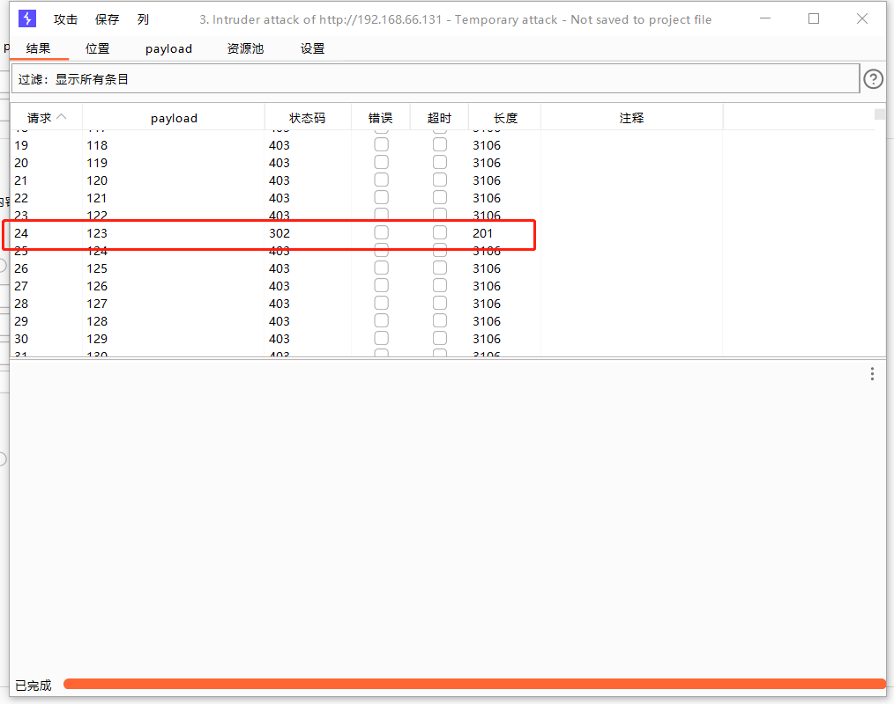
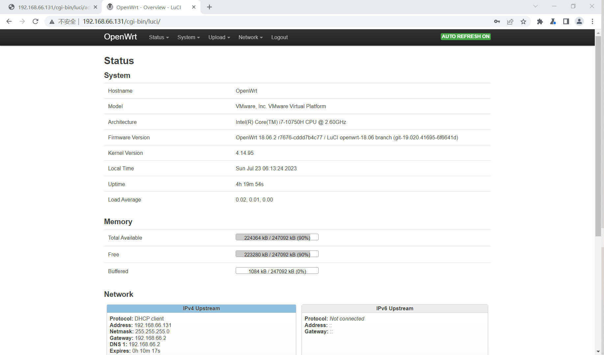

### build it

* 整体设计

    * 用户访问固件登陆界面，密码未知。通过输入任意值，利用burpsuite截获报文，可在请求头中得到一串提示（前缀cuc经过md5加密），由提示可知是六位密码，随后对后三位利用密码本进行爆破，获得最终密码`cuc123`，成功登录路由器后台。成功登陆后截获的报文中出现you win。

* `vim /usr/lib/lua/luci/dispatcher.lua`找到以下位置修改,在报文请求头中添加提示：

```lua
if not sid then
				local tmpl = require "luci.template"

				context.path = {}

				http.status(403, "Forbidden")
                --luci.http.header("Hint", "total length is 6,f1f4e30acef64bd0d346b050e73289e7")
				tmpl.render(track.sysauth_template or "sysauth", {
					duser = default_user,
					fuser = user
				})

				return
			end

			http.header("Set-Cookie", 'sysauth=%s; path=%s; HttpOnly%s' %{
				sid, build_url(), http.getenv("HTTPS") == "on" and "; secure" or ""
			})
            --luci.http.header("Congradulations:", "flag{123}")
			http.redirect(build_url(unpack(ctx.requestpath)))
		end

		if not sid or not sdat then
			http.status(403, "Forbidden")
            --luci.http.header("Hint", "total length is 6,f1f4e30acef64bd0d346b050e73289e7")
			return
		end

		ctx.authsession = sid
		ctx.authtoken = sdat.token
		ctx.authuser = sdat.username
	end

```

### write up

* 随意输入密码，burpsuite抓包获得提示



* 确定密码是六位，获得一串密文：`totallengthis6,f1f4e30acef64bd0d346b050e73289e7`，攻击者后续通过对`f1f4e30acef64bd0d346b050e73289e7`进行MD5解密得到前缀`cuc`：



* 猜测密码`cuc345`，再次抓包，将截获的报文发送至intruder，payload选中`345`，进行爆破：





* 获得后三位密码：



* 登陆成功：



### fix it

* 防止密码被轻易爆破，建议使用位数更多，更加复杂的密码，使用sha256加密。