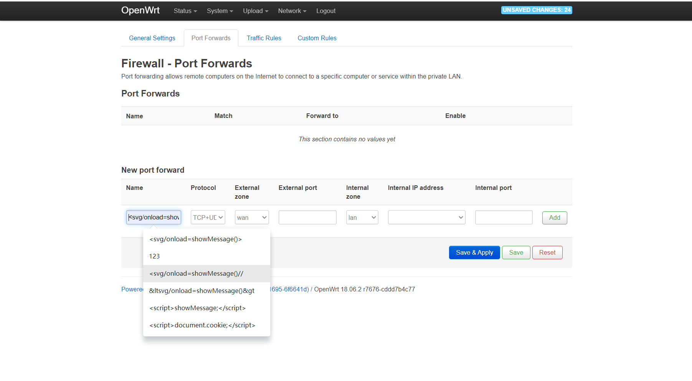
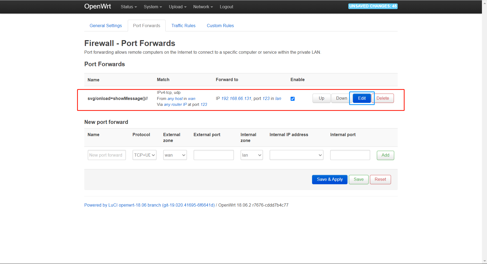
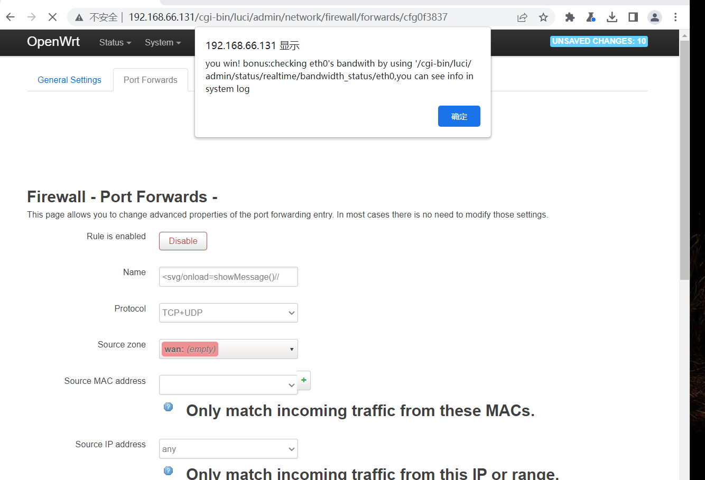

### build it

* 整体设计

    * 攻击者在成功登陆之后需要找到xss攻击点，绕过我们设置的限制，(通过过滤尖括号)，才能获得提示信息。在设计时，为了防止攻击者直接查看源码得到提示信息，我们将提示信息写入了一个js文件(showMessage.js)。

    * 利用导航栏`firewall port-forward` 的 `name` 字段构造 xss，将答案放在`showMessage.js`的函数里，执行这个函数会弹窗给出提示信息

    * 编写js文件并将其放在 `luci-static/resources`目录下，并在`nsection.htm`中加入`<script src="/luci-static/resources/showM.js"></script>`；用户根据藏在界面源码的提示知道需要触发 showMessage函数。

* 难点

    * 过滤字段，在`forward-details.lua`,对`<xx>`过滤

```lua
        function escape(input)
            local stripTagsRE = "</?[^>]+>"
            local filteredInput = string.gsub(input, stripTagsRE, "")
            return filteredInput    
        end
```

* 解决方法

    * 输入`<svg onload=showMessage()//`可以绕过

### write up

* 前往导航栏`network-port forwards`进行xss攻击，注意过滤尖括号，成功后将拿到下一题提示。







### fix it

* 修改`vim usr/model/cbi/firewall/forward-details.lua`

```lua
if not name or #name == 0 then
		name = translate("(Unnamed Entry)")
	end
	m.title = "%s - %s" %{ translate("Firewall - Port Forwards"), name }
	--m.title = "%s - %s" %{ translate("Firewall - Port Forwards"), luci.util.pcdata(name) }
end

s = m:section(NamedSection, arg[1], "redirect", "")
```

* `vim usr/model/cbi/firewall/rule-details.lua`

```lua
		name = "SNAT %s" % name
	end

	m.title = "%s - %s" %{ translate("Firewall - Traffic Rules"), name }
	--m.title = "%s - %s" %{ translate("Firewall - Traffic Rules"), luci.util.pcdata(name) }

	local wan_zone = nil
```