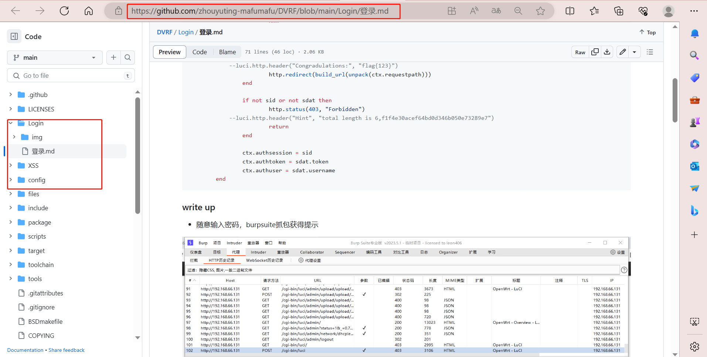
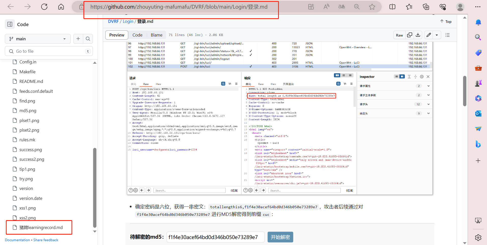

### 工作内容简介

本次小学期我主要负责的部分是进行web漏洞题目设计，主要工作内容涉及了第一题获得登陆密码以及第二题xss的题目设置，包括buildit，breakit以及fixit。涉及这部分的代码文件由汪睿同学一起提交。

在为期20天的学习中，我不仅学习了更多漏洞类型，更加深入地了解了跨站脚本漏洞，注入漏洞，暴力破解，csrf攻击等等。也利用openwrt源码，修改内容尝试自己编译个性化的固件，学习了lua语言，在后期的web漏洞题型的设计中修改代码，设计题目等方面起到了重要的作用。

在编译完成之后虚拟机尝试使用vscode远程连接，但出现了`Could not establish connection to "192.168.23.130". bash not found`的问题，由於安装完之后提示架构不对，最终的开发使用了ftp这个远程编写工具。这也算一个让我印象深刻的“改变”。

总体来说，本次小学期我的工作内容不多，但是过程中每天都在跟着小组一起学习不同的知识，它们有的被应用在了最终成果中，而有的对我未来的学习或许是一种积累。整个过程中，组员们都积极交流，互相督促互相请教，基本每两三天就会开一次组会交流工作进度，分享遇到的问题，共同解决，这也让我体会到了团队的意义。

#### web漏洞设计

**获得登录密码**

* 整体设计以及解题思路

    * 用户访问固件登陆界面，密码未知。通过输入任意值，利用burpsuite截获报文，可在请求头中得到一串提示（前缀cuc经过md5加密）：`totallengthis6,f1f4e30acef64bd0d346b050e73289e7`，攻击者后续通过对`f1f4e30acef64bd0d346b050e73289e7`进行MD5解密得到前缀`cuc`，由提示可知是六位密码，随后对后三位利用密码本进行爆破，获得最终密码`cuc123`，成功登录路由器后台。成功登陆后截获的报文中出现flag。

* `vim /usr/lib/lua/luci/dispatcher.lua`找到以下位置修改,在报文请求头中添加提示：

```lua
if not sid then
				local tmpl = require "luci.template"

				context.path = {}

				http.status(403, "Forbidden")
                --luci.http.header("Hint", "total length is 6,f1f4e30acef64bd0d346b050e73289e7")
				tmpl.render(track.sysauth_template or "sysauth", {
					duser = default_user,
					fuser = user
				})

				return
			end

			http.header("Set-Cookie", 'sysauth=%s; path=%s; HttpOnly%s' %{
				sid, build_url(), http.getenv("HTTPS") == "on" and "; secure" or ""
			})
            --luci.http.header("Congradulations:", "flag{123}")
			http.redirect(build_url(unpack(ctx.requestpath)))
		end

		if not sid or not sdat then
			http.status(403, "Forbidden")
            --luci.http.header("Hint", "total length is 6,f1f4e30acef64bd0d346b050e73289e7")
			return
		end

		ctx.authsession = sid
		ctx.authtoken = sdat.token
		ctx.authuser = sdat.username
	end

```

**xss**

* 整体设计思路

    * 攻击者在成功登陆之后需要找到xss攻击点，绕过我们设置的限制，(通过过滤尖括号)，才能获得提示信息。同时设计了base32编码等“别出心裁”的，不同于直接进行base64编码的方式“为难”攻击者。在设计时，为了防止攻击者直接查看源码得到提示信息，我们将提示信息写入了一个js文件(showMessage.js)，以获得下一题“命令注入”的相关提示。

    * 利用导航栏`firewall port-forward` 的 `name` 字段构造 xss，将答案放在`showMessage.js`的函数里，执行这个函数会弹窗给出提示信息

    * 编写js文件并将其放在 `luci-static/resources`目录下，并在`nsection.htm`中加入`<script src="/luci-static/resources/showM.js"></script>`；用户根据藏在界面源码的提示知道需要触发 showMessage函数。

* 难点

    * 过滤字段，在`forward-details.lua`,对`<xx>`过滤

```lua
        function escape(input)
            local stripTagsRE = "</?[^>]+>"
            local filteredInput = string.gsub(input, stripTagsRE, "")
            return filteredInput    
        end
```

* 解决方法

    * 输入`<svg onload=showMessage()//`可以绕过

#### 题目一 思路

* 用户登录需要输入密码，依据这一必要条件设计题目。

* 由于密码未知，目的是希望用户通过随意输入密码提交，同时后台进行抓包，用户从报文中获得提示，依据提示解题。

#### 题目一 解题过程(具体见[Login](https://github.com/zhouyuting-mafumafu/DVRF/tree/record/Login))

* 随意输入密码，burpsuite抓包获得提示

* 确定密码是六位，获得一串密文，猜测MD5加密，进行解密：

* 猜测密码`cuc345`，再次抓包，将截获的报文发送至intruder，payload选中`345`，进行爆破：

* 获得后三位密码

* 登陆成功，此处将会提示下一题的攻击内容：


#### 题目一 fix it

* 防止密码被轻易爆破，建议是使用位数更多，且更加复杂的密码，并且使用sha256加密。

#### 题目二 fix it(writeup见[XSS](https://github.com/zhouyuting-mafumafu/DVRF/tree/record/XSS))

* vim usr/model/cbi/firewall/forward-details.lua
```lua
if not name or #name == 0 then
		name = translate("(Unnamed Entry)")
	end
	--m.title = "%s - %s" %{ translate("Firewall - Port Forwards"), name }
	m.title = "%s - %s" %{ translate("Firewall - Port Forwards"), luci.util.pcdata(name) }
end

s = m:section(NamedSection, arg[1], "redirect", "")
```

* vim usr/model/cbi/firewall/rule-details.lua

```lua
		name = "SNAT %s" % name
	end

	--m.title = "%s - %s" %{ translate("Firewall - Traffic Rules"), name }
	m.title = "%s - %s" %{ translate("Firewall - Traffic Rules"), luci.util.pcdata(name) }

	local wan_zone = nil
```

### 学习笔记

#### 编译OpenWrt定制属于自己的固件

* 实验环境

    * 虚拟机：Ubuntu22.04 LTS x64

    * 外部系统：win10

* 注意事项

    * 不要使用root用户

    * 编译过程需要科学上网


* 准备编译环境

```bash
##添加用户
adduser openwrt
usermod -a -G sudo openwrt
su openwrt
##更新组件
sudo apt update
##下载安装编译环境
sudo apt-get -y install build-essential asciidoc binutils bzip2 gawk gettext git libncurses5-dev libz-dev patch python3 python2.7 unzip zlib1g-dev lib32gcc1 libc6-dev-i386 subversion flex uglifyjs git-core gcc-multilib p7zip p7zip-full msmtp libssl-dev texinfo libglib2.0-dev xmlto qemu-utils upx libelf-dev autoconf automake libtool autopoint device-tree-compiler g++-multilib antlr3 gperf wget curl swig rsync
```

回显出现`this may take some time…done`就是下载成功了。

* 拉取并修改openwrt源码

可以查看iotgoat的network里面commit的记录，学习修改

```bash
##iotgoat源码
https://github.com/OWASP/IoTGoat/network
##关键文件路径
OpenWrt/openwrt-18.06.2/files/usr/lib/lua/luci
```

fork源码至本地仓库，在files文件夹内添加自己编写的lua和htm，定制个性化系统。

```bash
##lede 源码地址
https://github.com/coolsnowwolf/lede
## 源代码仓库在Github上的一个镜像
https://github.com/openwrt/openwrt
```


* 更新下载feeds

进入 `feeds.conf.default`

添加插件地址：

```bash
src-git kenzok https://github.com/kenzok8/openwrt-packages
src-git small https://github.com/kenzok8/small
```

随后终端进入源码目录(cd lede或cd openwrt)，输入：

```bash
./scripts/feeds update -a （更新feeds源）
./scripts/feeds install -a （安装feeds源）
```

* 配置文件

第一种是在源码中添加界面方式，如上文拉取修改openwrt源码。
第二种是此处在开发板系统中添加界面方式。在系统板上修改界面配置文件后，可以马上在网页端看到修改效果，不用重新编译Openwrt源码和烧写固件，优点：开发便捷，缺点：重刷系统后相关文件修改信息丢失。

如果选择第二种方式 建议是menuconfig的默认配置通过第一次编译之后再自定义，这样编译成功率会更高。如果不打算调整组件则输入`make defconfig`，它会检测编译环境并生成默认的编译配置文件。需要配置则输入`make menuconfig`

图形配置界面:
```bash
OpenWrt Configuration【OpenWrt配置】

Target System (x86) —> 目标系统（x86）

Subtarget (x86_64) —> 子目标（x86_64）

Target Profile (Generic) —>目标配置文件（通用）

Target Images —> 保存目标镜像的格式

Enable experimental features by default —> 默认情况下启用实验功能

Global build settings —> 全局构建设置

Advanced configuration options (for developers) ---- 高级配置选项（适用于开发人员）

Build the OpenWrt Image Builder 构建OpenWrt图像生成器

Build the OpenWrt SDK构建OpenWrt SDK

Package the OpenWrt-based Toolchain打包基于OpenWrt的工具链

Image configuration —>图像配置

Base system —> 基本系统

Administration —> 管理

Boot Loaders —>引导加载程序

Development —> 开发

Extra packages —> 额外包

Firmware —>固件

Fonts —>字体

Kernel modules —> 内核模块

Languages —>语言

Libraries —> 图书馆

LuCI —> LuCI 软件包

Mail —>邮件

Multimedia —>多媒体

Network —>网络

Sound —> 声音

Utilities —>实用程序

Xorg —>Xorg
```
建议选项，视自身情况而定：
```bash
1.选择CPU型号
Target System—–Atheros AR71xx/AR7240/AR913x/AR934x

2.选择路由型号
Target Profile—-TP-LINK TL-MR3420 v1

3.添加luci
 LuCI—>Collections—– <*> luci

4.添加luci的中文语言包
LuCI—>Translations—- <*> luci-i18n-chinese

5.添加DDNS
LuCI—>Applications —> <*>luci-app-ddns.

6.添加USB挂载
Base system —> <*>block-mount

7.添加硬盘格式支持
Kernel modules —> Filesystems —> <*> kmod-fs-ext4

8.添加UTF8编码
Kernel modules —> Native Language Support —> <*> kmod-nls-utf8

9.添加USB扩展支持
Kernel modules —> USB Support —> <*> kmod-usb-storage-extras.

110.添加自动挂载工具
Utilities —> Filesystem —> <*> badblocks

11.添加复位键支持
Utilities —> <*> restorefactory

12.添加一键开关无线
Utilities —> <*> wifitoggle

 最简单的，只需要选正面两项，其余默认即可： 
1、 Target System—–选择编译类型
2、 Target Profile—-选择编译路由型号
```

* 下载dl库

```bash
make -j8 download V=s
##find dl -size -1024c -exec ls -l {} 此命令可以列出下载不完整的文件（小于1k的文件属于下载不完整）,如果存在这样的文件可以使用find dl -size -1024c -exec rm -f {} ;命令将它们删除，然后重新执行make download下载并反复检查
```

* 开始编译

```bash
make V=s -j1
##第一次编译推荐用单线程以后可以使用make -j$(($(nproc) + 1)) V=s
```
编译完成后输出路径(lede目录下)：`bin/targets`

* 二次编译
```bash
cd lede   #切换到lede目录 
git pull  #拉取最新源码 
./scripts/feeds update -a   #更新软件源，有下载。若源码没有更新，则本条及下条可以不执行 
./scripts/feeds install -a  #安装软件源，无下载 
make defconfig
make download -j8
make V=s -j$(nproc)

##重新配置
rm -rf ./tmp && rm -rf .config # 清除临时文件 删除编译配置文件
make menuconfig
make V=s -j$(nproc)
```

#### LUA语法学习

* 区分大小写

* Lua 交互式编程模式可以通过命令 `lua -i` 或 `lua` 来启用

* Lua 脚本式编程将 Lua 程序代码保存到一个以 lua 结尾的文件，如`zyt.lua`，并执行。使用lua加文本名来执行：`lua zyt.lua`

* **LUA数据类型**

|数据类型|描述|
|--|--|
|nil|表示一个无效值（在条件表达式中相当于false）。|
|boolean|包含两个值：false和true。|
|number|表示双精度类型的实浮点数|
|string|字符串由一对双引号或单引号来表示|
|function|由 C 或 Lua 编写的函数|
|userdata|表示任意存储在变量中的C数据结构|
|thread|表示执行的独立线路，用于执行协同程序|
|table|Lua 中的表（table）其实是一个"关联数组"（associative arrays），数组的索引可以是数字、字符串或表类型。在 Lua 里，table 的创建是通过"构造表达式"来完成，最简单构造表达式是{}，用来创建一个空表。|

* tips：

    * boolean 类型只有两个可选值：true（真） 和 false（假），Lua 把 false 和 nil 看作是 false，其他的都为 true，数字 0 也是 true:

    * 字符串由一对双引号或单引号来表示，可以用 2 个方括号 `[[]]` 来表示"一块"字符串。

    * 在 Lua 中，函数是被看作是"第一类值（First-Class Value）"，函数可以存在变量里;function 可以以匿名函数（anonymous function）的方式通过参数传递。

* LUA变量

    * Lua 中的变量全是全局变量，哪怕是语句块或是函数里，除非用 local 显式声明为局部变量。
    
    * Lua 可以对多个变量同时赋值，变量列表和值列表的各个元素用逗号分开，赋值语句右边的值会依次赋给左边的变量。遇到赋值语句Lua会先计算右边所有的值然后再执行赋值操作。
    
    * 当变量个数和值的个数不一致时，Lua会一直以变量个数为基础采取以下策略：变量个数 > 值的个数就按变量个数补足nil；变量个数 < 值的个数那么多余的值会被忽略。如果要对多个变量赋值必须依次对每个变量赋值。

    * 多值赋值经常用来交换变量，或将函数调用返回给变量：

        * a, b = f()-->f()返回两个值，第一个赋给a，第二个赋给b。

    * 索引

        * 对 table 的索引使用方括号 `[]`，或者`.`

* LUA函数

```bash
    optional_function_scope function function_name( argument1, argument2, argument3..., argumentn)
    function_body
    return result_params_comma_separated
end

## optional_function_scope: 该参数是可选的指定函数是全局函数还是局部函数，未设置该参数默认为全局函数，如果你需要设置函数为局部函数需要使用关键字 local。

##function_name: 指定函数名称。

##argument1, argument2, argument3..., argumentn: 函数参数，多个参数以逗号隔开，函数也可以不带参数。

##function_body: 函数体，函数中需要执行的代码语句块。

##result_params_comma_separated: 函数返回值，Lua语言函数可以返回多个值，每个值以逗号隔开。
```

>实际应用时也可以将函数作为参数传递给函数

>Lua 函数可以接受可变数目的参数，和 C 语言类似，在函数参数列表中使用三点 ... 表示函数有可变的参数。select('#', …) 返回可变参数的长度。select(n, …) 用于返回从起点 n 开始到结束位置的所有参数列表。

* LUA算术运算符tips

    * `//`->整除运算符，如：5//2=2

        * lua 中，/ 用作除法运算，计算结果包含小数部分，// 用作整除运算，计算结果不包含小数部分。
    
    * 关系运算符与逻辑运算符和python几乎相同

    * 其他运算符

    |操作符|描述|实例|
    |--|--|--|
    |..	|连接两个字符串|a..b ，其中 a 为 "Hello " ， b 为 "World", 输出结果为 "Hello World"。|
    |#|一元运算符，返回字符串或表的长度。|#"zytzyt" 返回 6|

    * 算符优先级(从高到低)
    > ^
    >not    - (unary)
    >`* `  /   %
    >`+`  -
    >..
    ><      >      <=     >=     ~=     ==
    >and
    >or

* table操作

|命令|用途|
|--|--|
|table.concat (table [, sep [, start [, end]]]):|concat是concatenate(连锁, 连接)的缩写. table.concat()函数列出参数中指定table的数组部分从start位置到end位置的所有元素, 元素间以指定的分隔符(sep)隔开。|
|table.insert (table, [pos,] value):|在table的数组部分指定位置(pos)插入值为value的一个元素. pos参数可选, 默认为数组部分末尾.|
|table.remove (table [, pos])|返回table数组部分位于pos位置的元素. 其后的元素会被前移. pos参数可选, 默认为table长度, 即从最后一个元素删起。|
|table.sort (table [, comp])|对给定的table进行升序排序。|

* LUA模块

    * Lua 的模块是由变量、函数等已知元素组成的 table，因此创建一个模块很简单，就是创建一个 table，然后把需要导出的常量、函数放入其中，最后返回这个 table 就行。模块的结构就是一个 table 的结构，因此可以像操作调用 table 里的元素那样来操作调用模块里的常量或函数。

    * Lua提供了一个名为require的函数用来加载模块。要加载一个模块，只需要简单地调用就可以了。如`require("<模块名>")`或`require"<模块名>"`

* LUA元表

    *  Lua 提供了元表`(Metatable)`，允许我们改变 table 的行为，每个行为关联了对应的元方法。例如，使用元表我们可以定义 Lua 如何计算两个 table 的相加操作。当 Lua 试图对两个表进行相加时，先检查两者之一是否有元表，之后检查是否有一个叫 `__add` 的字段，若找到，则调用对应的值。 `__add` 等即时字段，其对应的值（往往是一个函数或是 table）就是"元方法"。

    >`setmetatable(table,metatable)`: 对指定 table 设置元表`(metatable)`，如果元表`(metatable)`中存在`__metatable` 键值，`setmetatable` 会失败。

    >`getmetatable(table)`: 返回对象的元表`(metatable)`。

    * __index 元方法

        * 这是 `metatable` 最常用的键。当通过键来访问 table 的时候，如果这个键没有值，那么Lua就会寻找该table的`metatable`（假定有metatable）中的`__index` 键。如果`__index`包含一个表格，Lua会在表格中查找相应的键。
        * 如果`__index`包含一个函数的话，Lua就会调用那个函数，table和键会作为参数传递给函数。`__index` 元方法查看表中元素是否存在，如果不存在，返回结果为 nil；如果存在则由 `__index` 返回结果。

        * Lua 查找一个表元素时的规则，其实就是如下 3 个步骤:
            * 1.在表中查找，如果找到，返回该元素，找不到则继续
            * 2.判断该表是否有元表，如果没有元表，返回 nil，有元表则继续。
            * 3.判断元表有没有` __index` 方法，如果 `__index` 方法为 nil，则返回 nil；如果 `__index` 方法是一个表，则重复 1、2、3；如果` __index` 方法是一个函数，则返回该函数的返回值。


    * __newindex 元方法

        * __newindex 元方法用来对表更新，__index则用来对表访问。当你给表的一个缺少的索引赋值，解释器就会查找__newindex 元方法：如果存在则调用这个函数而不进行赋值操作。

    * __call 元方法

        * __call 元方法在 Lua 调用一个值时调用。

    * __tostring 元方法

        * __tostring 元方法用于修改表的输出行为。
        ```bash
        mytable = setmetatable({ 10, 20, 30 }, {
            __tostring = function(mytable)
                sum = 0
                for k, v in pairs(mytable) do
                        sum = sum + v
                    end
                return "表所有元素的和为 " .. sum
            end
        })
        print(mytable)
        ```

* Lua 文件 I/O

    * Lua I/O 库用于读取和处理文件。分为简单模式、完全模式。

        * 简单模式（simple model）拥有一个当前输入文件和一个当前输出文件，并且提供针对这些文件相关的操作。

            *  `io.tmpfile()`:返回一个临时文件句柄，该文件以更新模式打开，程序结束时自动删除

            * `io.type(file)`: 检测obj是否一个可用的文件句柄

            * `io.flush()`: 向文件写入缓冲中的所有数据

            * `io.lines(optional file name)`: 返回一个迭代函数，每次调用将获得文件中的一行内容，当到文件尾时，将返回 nil，但不关闭文件。

        * 完全模式（complete model） 使用外部的文件句柄来实现。它以一种面对对象的形式，将所有的文件操作定义为文件句柄的方法

            * `file:seek(optional whence, optional offset)`: 设置和获取当前文件位置,成功则返回最终的文件位置(按字节),失败则返回nil加错误信息。参数 whence 值可以是:

                * `"set"`: 从文件头开始
                * `"cur"`: 从当前位置开始[默认]
                * `"end"`: 从文件尾开始
                * `offset`:默认为0
             不带参数`file:seek()`则返回当前位置,`file:seek("set")`则定位到文件头,`file:seek("end")`则定位到文件尾并返回文件大小

            * f`ile:flush()`: 向文件写入缓冲中的所有数据

            * `io.lines(optional file name)`: 打开指定的文件 `filename` 为读模式并返回一个迭代函数，每次调用将获得文件中的一行内容，当到文件尾时，将返回 nil，并自动关闭文件。
若不带参数时`io.lines() <=> io.input():lines()`; 读取默认输入设备的内容，但结束时不关闭文件

* LUA垃圾回收

    * Lua 提供了以下函数collectgarbage ([opt [, arg]])用来控制自动内存管理:

        * `collectgarbage("collect")`: 做一次完整的垃圾收集循环。通过参数 opt 它提供了一组不同的功能：

        * `collectgarbage("count")`: 以 K 字节数为单位返回 Lua 使用的总内存数。 这个值有小数部分，所以只需要乘上 1024 就能得到 Lua 使用的准确字节数（除非溢出）。

        * `collectgarbage("restart")`: 重启垃圾收集器的自动运行。

        * `collectgarbage("setpause")`: 将 arg 设为收集器的 间歇率。 返回 间歇率 的前一个值。

        * `collectgarbage("setstepmul")`: 返回 步进倍率 的前一个值。

        * `collectgarbage("step")`: 单步运行垃圾收集器。 步长"大小"由 arg 控制。 传入 0 时，收集器步进（不可分割的）一步。 传入非 0 值， 收集器收集相当于 Lua 分配这些多（K 字节）内存的工作。 如果收集器结束一个循环将返回 true 。

        * `collectgarbage("stop")`: 停止垃圾收集器的运行。 在调用重启前，收集器只会因显式的调用运行。

#### 网络配置

完成以下配置，在浏览器输入ip:`192.168.23.15`登录固件及下载相关软件包

* `vim /etc/config/network`

    * 修改ipaddr以`192.168.23.15`

* `vim /etc/resolv.conf`

    * 修改`nameserver`为`8.8.8.8`

#### ftp远程连接

ftp远程连接虚拟机方便修改相关文件

* 在虚拟机中
`opkg update`
`opkg install vsftpd`

* 主机在vscode内搜索扩展`ftp-simple`，下载并安装

* `shift+ctrl+p`搜索`config-ftp connection setting`进行配置，编辑：
```bash
[
	{
		"name": "dvrf",
		"host": "192.168.23.128",
		"port": 21,
		"type": "ftp",
		"username": "root",
		"password": "zytzyt",
		"path": "/",
		"autosave": true,
		"confirm": true
	}
]
```

* `shift+ctrl+p`搜索`remote directory open to workspace`，然后在其中选择文件夹传输即可。

#### 修改banner

`etc/banner`
修改个性化banner
```bash
██████╗ ██╗   ██╗██████╗ ███████╗
██╔══██╗██║   ██║██╔══██╗██╔════╝
██║  ██║██║   ██║██████╔╝█████╗  
██║  ██║╚██╗ ██╔╝██╔══██╗██╔══╝  
██████╔╝ ╚████╔╝ ██║  ██║██║     
╚═════╝   ╚═══╝  ╚═╝  ╚═╝╚═╝     
    Damn Vulnerable Router Firmware 
-----------------------------------------------------
Based on Openwrt
Developed by students from Communication University of China
-----------------------------------------------------
```

#### 添加子页或导航栏

**添加子页**

* `vim /usr/lib/lua/luci/controller/admin/system.lua`

```bash
entry({"admin","system","zytzytzyt"},template("admin_system/zytzytzyt),_("zytzytzyt") , 99)
```

* `vim /usr/lib/lua/luci/view/admin_system/zytzytzyt.htm`

```bash
<%+header%>
<h1><%: ZYTZYTZYT%></h1>
<%+footer%>
```

后续可以构造网页，隐藏信息、提示信息等等

**添加导航栏标签**

如：

* `vim package/feeds/luci/luci-mod-admin-full/luasrc/controller/admin/new_tab.lua`

```bash
module("luci.controller.admin.new_tab", package.seeall)
 
function index()
        entry({"admin", "new_tab"}, firstchild(), "New tab", 60).dependent=false
        -- entry({"admin", "new_tab", "tab_from_cbi"}, cbi("myapp-mymodule/cbi_tab"), "CBI Tab", 1)
        entry({"admin", "new_tab", "tab_from_view"}, template("admin_myapp/view_tab"), "View Tab", 2)
end
```

* `mkdir package/feeds/luci/luci-mod-admin-full/luasrc/view/admin_myapp`

* `vim package/feeds/luci/luci-mod-admin-full/luasrc/view/admin_myapp/view_tab.htm`

```bash
<%+header%>
<h1><%: ZYTZYTZYT%></h1>
<%+footer%>
```

**有缓存，清除缓存和重启服务器**

`/etc/init.d/uhttpd restart`

`rm –fr /tmp/luci-*`

#### MVC

* **view** – 模板系统Template，控制前端显示效果,类似 C语言开发 CGI 的 flate 库，java 的 jsp 技术
    
    * openwrt 系统路径 /usr/lib/lua/luci/view/

    * 内容替换格式
        ```bash
        <%+[include]%>：引用模板 (ex: <%+header%>; <%+footer%>)
        <%:[string]%>：输出内容 (ex: <%:Hello World%>)
        <%=[code]%>：执行 lua 代码
        等等...
        ```

* **controller** – 控制器，路由逻辑和功能（function）入口，使用lua语言

    * index 中通过 entry 声明了 url 和该 url 对应的行为（function）

    * 主要为 call, template, cbi 三种行为

        * call – 直接执行定义的函数
        * template – 渲染指定 *.htm 模板作为响应返回
        * cbi – 执行以 CBI 框架编写的模块

* **model** – 配置管理，(数据)模型系统/资源配置

    * 模型就是 CBI -- 操作 UCI
        
        * CBI(Configuration Binding Interface) ->UCI(Unified Configuration Interface)

    * CBI 也算是一个框架，用户（程序员）编写的是“模块”


#### 问题

* `opkg update&&opkg install vsftpd`遇到

```bash
Collected errors:
 * opkg_download: Failed to download http://downloads.openwrt.org/releases/18.06.2/packages/i386_pentium4/packages/Packages.gz, wget returned 4.
 * opkg_download: Check your network settings and connectivity.

 * opkg_download: Failed to download http://downloads.openwrt.org/releases/18.06.2/packages/i386_pentium4/telephony/Packages.sig, wget returned 4.
 * opkg_download: Check your network settings and connectivity.
```

网络是联通的，根据网友提示使用`wget`命令将包重新下载，但是未果。随后尝试更换openwrt 的opkg release镜像源，成功下载。
```bash
##手工替换
登录到路由器，并编辑 /etc/opkg/distfeeds.conf 文件，将其中的 downloads.openwrt.org 替换为 mirrors.tuna.tsinghua.edu.cn/openwrt 即可。

##自动替换
执行如下命令自动替换

sed -i 's_downloads.openwrt.org_mirrors.tuna.tsinghua.edu.cn/openwrt_' /etc/opkg/distfeeds.conf
```

### 学习记录更新地址

学习commit记录在仓库：[zhouyuting（已失效）](https://github.com/zhouyuting-mafumafu/DVRF/blob/main/%E7%8C%AA%E8%B9%84learningrecord.md)

[zhouyuting](https://github.com/zhouyuting-mafumafu/DVRF/tree/record/learning%20record)

❗❗❗由于本人操作失误，学习记录最初记录在了上游仓库所fork的本人的主分支里，但是由于最后主仓库更新了，没有看清楚就直接Sync fork了之后，导致原来更新的记录都找不回来了，因为最初没有克隆到本地，就无法从本地的.git文件记录里找回。😫😫😭
但是可以从以下几张图片看出来确实是曾经存在过的，也多次commit至由于本人写报告有每次写完保存到本地还不够，喜欢发送到微信文件传输助手来确保文件“万无一失”，卑微证明一下：






### 参考文献
[清华大学opkg release镜像源](https://mirror.tuna.tsinghua.edu.cn/help/openwrt/)

[opkg update报错解决方法](https://blog.csdn.net/weixin_39510813/article/details/78564307)

[CVE-2019-17367](https://www.cvedetails.com/cve/CVE-2019-17367/)

[CVE-2019-18993](https://www.cvedetails.com/cve/CVE-2019-18993/)

[CVE-2019-18992](https://www.cvedetails.com/cve/CVE-2019-18992/)

[XSS](https://cloud.tencent.com/developer/article/1573003)

[XSS 过滤绕过备忘单](https://wizardforcel.gitbooks.io/owasp-cheat-sheet-zh/content/xss-filter-evasion-cheat-sheet.html)

[XSS ctf 题目](https://juejin.cn/s/ctf%20xss%20%E9%A2%98%E7%9B%AE)

[burpsuite](https://blog.csdn.net/guo15890025019/article/details/106297296)
